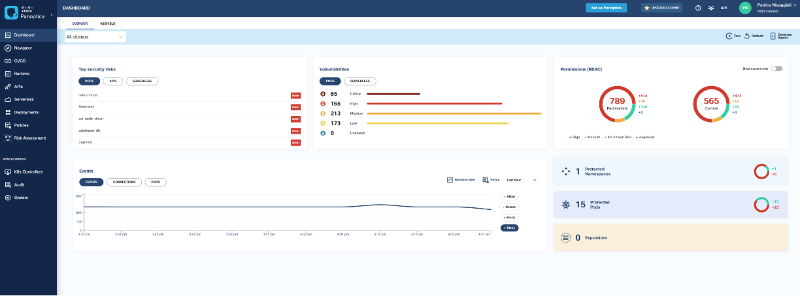

# Panoptica Overview

Cisco Panoptica is a Kubernetes-native platform delivering security for containers and Kubernetes. It leverages the power of Kubernetes and the service-mesh layer to secure containers and cloud-native applications.

With a single Panoptica pod deployment (running as an admission controller), DevOps can leverage the power of our "agent-less" (not a DaemonSet) solution to protect from vulnerabilities across images, containers, Kubernetes, runtime deployments, APIs and serverless functions.



# 01. Lab Overview


## Objectives

In this section you will:

- Task 1. Check K8s cluster readiness
- Task 2. Check K8s cluster control plane status
- Task 3. Understand your initial cluster configuration

## Task 1. Check K8s cluster readiness

A Kubernetes cluster based on Kind (Kubernetes in Docker) has been deployed for you. The cluster includes one control-plane and four worker nodes and leverages Calico CNI. It respects pre-requisites to have Panoptica onboarded. To learn more about the requirements, visit [this page](https://panoptica.readme.io/docs/quick-start-poc) and [this page](https://panoptica.readme.io/docs/deploy-on-a-kubernetes-cluster).

That installation takes time, let's check if the Calico Pods have reached the `Ready` state:

```bash
sleep 5 && kubectl wait pods --all=True -n calico-system --for=condition=Ready --timeout=60s
```

When cluster is deployed and ready you should have a similar output:

```console
eti-lab> sleep 5 && kubectl wait pods --all=True -n calico-system --for=condition=Ready --timeout=60s
pod/calico-kube-controllers-85666c5b94-8k8kc condition met
pod/calico-node-2vbzv condition met
pod/calico-node-57klr condition met
pod/calico-node-cnbh6 condition met
pod/calico-node-gd2tj condition met
pod/calico-node-gf7b8 condition met
pod/calico-typha-54c7f7b6cc-2hbqf condition met
pod/calico-typha-54c7f7b6cc-kwngb condition met
pod/calico-typha-54c7f7b6cc-lglxx condition met
pod/csi-node-driver-52kxj condition met
pod/csi-node-driver-j48x4 condition met
pod/csi-node-driver-kqdg9 condition met
pod/csi-node-driver-kxx2v condition met
pod/csi-node-driver-mrlnm condition met
```

## Task 2. Check K8s cluster control plane status

Check the coredns Pods are `Ready` and `Running`:

```bash
kubectl get pods --namespace=kube-system
```

```console
eti-lab> kubectl get pods --namespace=kube-system
NAME                                          READY   STATUS    RESTARTS      AGE
coredns-565d847f94-bcfm6                      1/1     Running   1 (10m ago)   2d22h
coredns-565d847f94-bsj9r                      1/1     Running   1 (10m ago)   2d22h
etcd-demo1-control-plane                      1/1     Running   0             9m29s
kube-apiserver-demo1-control-plane            1/1     Running   0             9m30s
kube-controller-manager-demo1-control-plane   1/1     Running   1 (10m ago)   2d22h
kube-proxy-989qg                              1/1     Running   1 (10m ago)   2d22h
kube-proxy-9kljk                              1/1     Running   1 (10m ago)   2d22h
kube-proxy-p8l8z                              1/1     Running   1 (10m ago)   2d22h
kube-proxy-wbzct                              1/1     Running   1 (10m ago)   2d22h
kube-proxy-zjn4f                              1/1     Running   1 (10m ago)   2d22h
kube-scheduler-demo1-control-plane            1/1     Running   1 (10m ago)   2d22h
```

## Task 3. Understand your initial cluster configuration

Check the deployed cluster include 1x control plane and 4x worker nodes:

```bash
kubectl get nodes
```

```console
eti-lab> kubectl get nodes
NAME                  STATUS   ROLES           AGE     VERSION
demo1-control-plane   Ready    control-plane   2d22h   v1.25.3
demo1-worker          Ready    <none>          2d22h   v1.25.3
demo1-worker2         Ready    <none>          2d22h   v1.25.3
demo1-worker3         Ready    <none>          2d22h   v1.25.3
demo1-worker4         Ready    <none>          2d22h   v1.25.3
```

Check the existing namespace:

```bash
kubectl get ns
```

```console
eti-lab> kubectl get ns
NAME                 STATUS   AGE
calico-apiserver     Active   2d22h
calico-system        Active   2d22h
default              Active   2d22h
kube-node-lease      Active   2d22h
kube-public          Active   2d22h
kube-system          Active   2d22h
local-path-storage   Active   2d22h
metallb-system       Active   2d22h
tigera-operator      Active   2d22h
```

---
