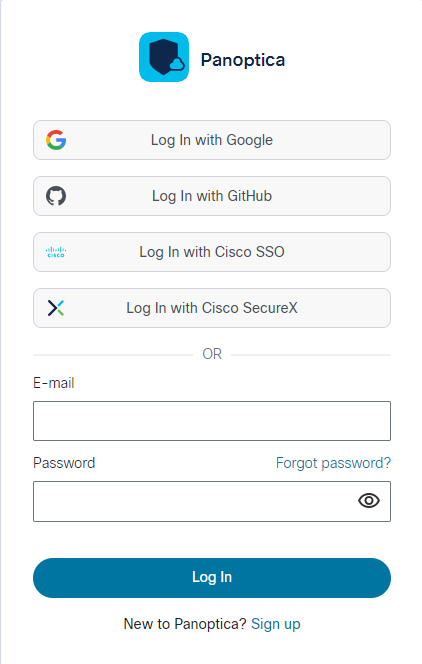
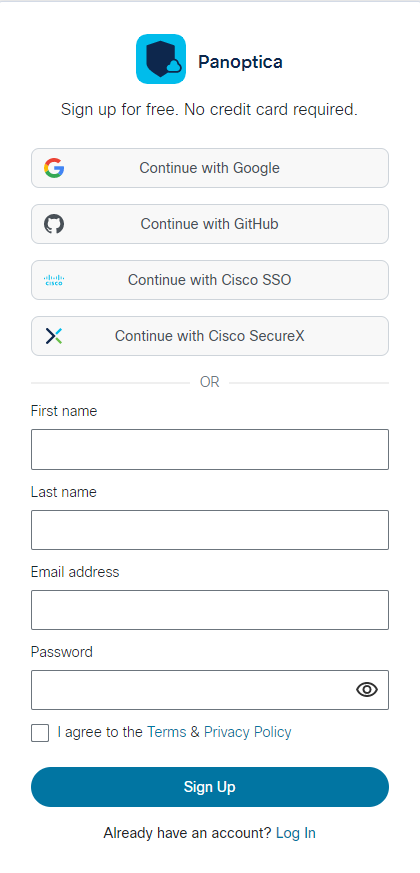
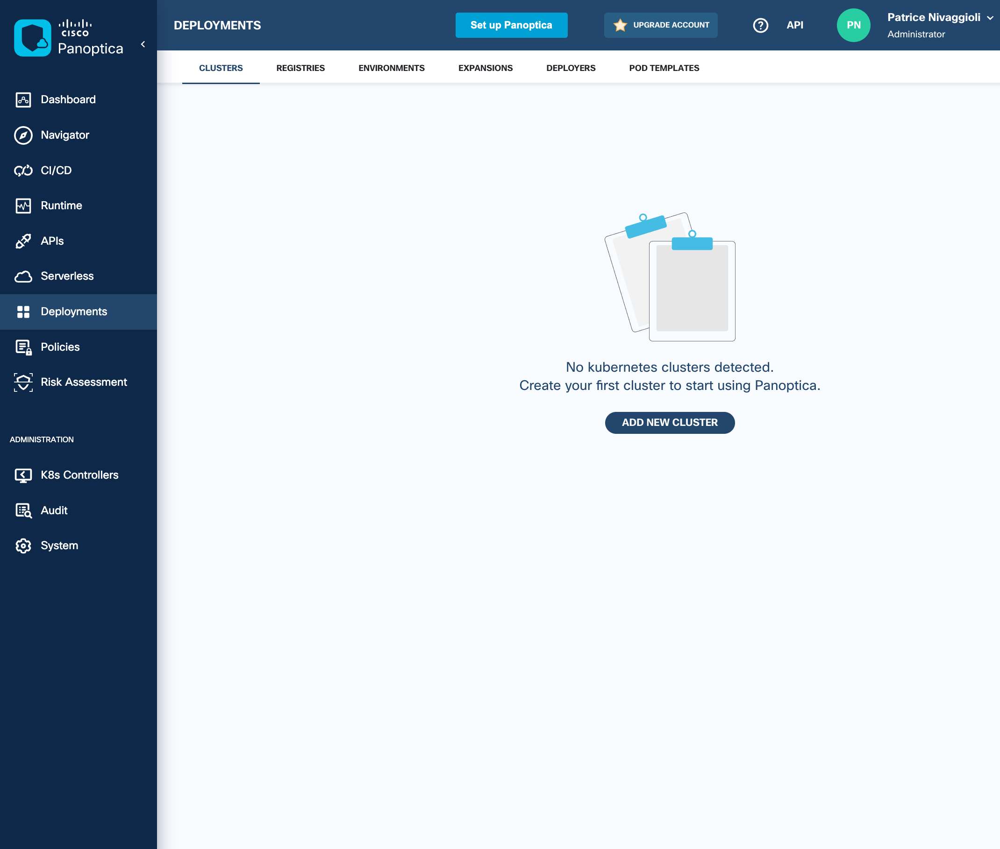
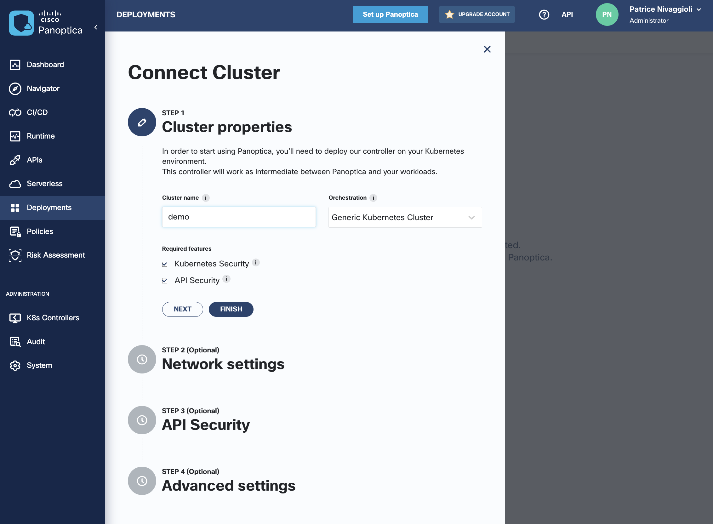
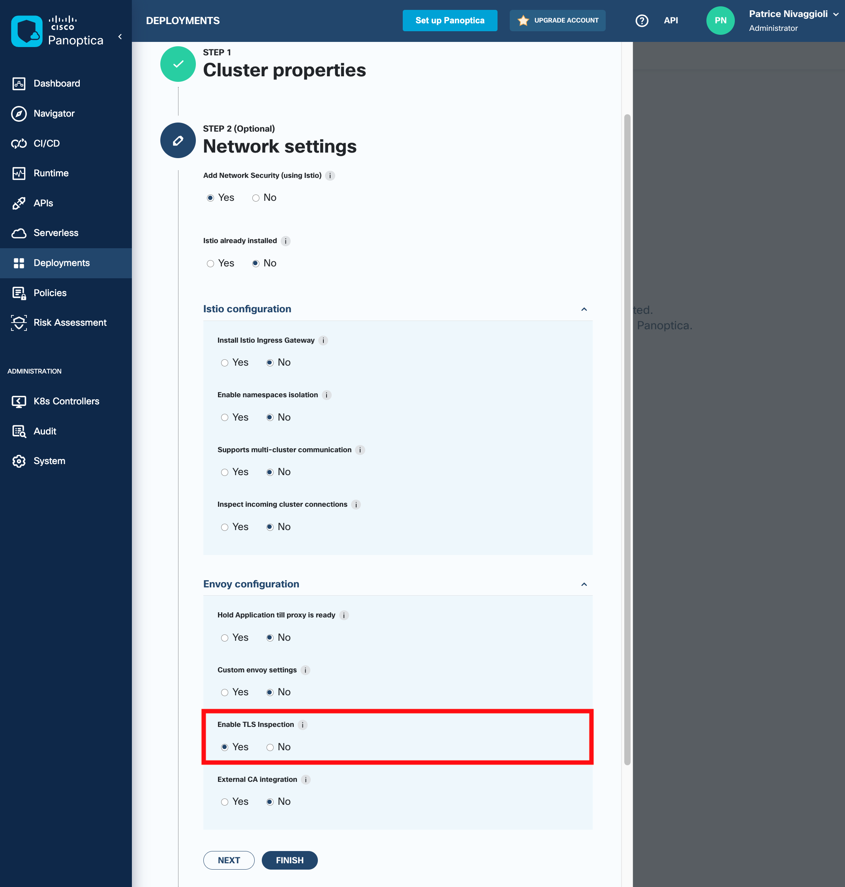
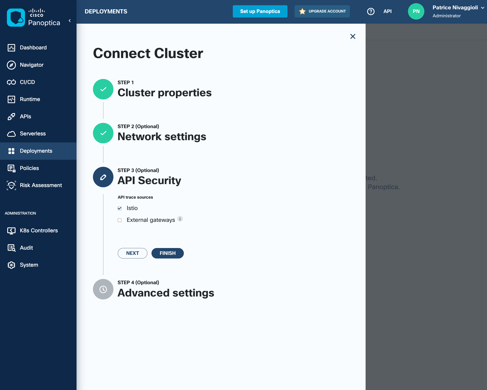
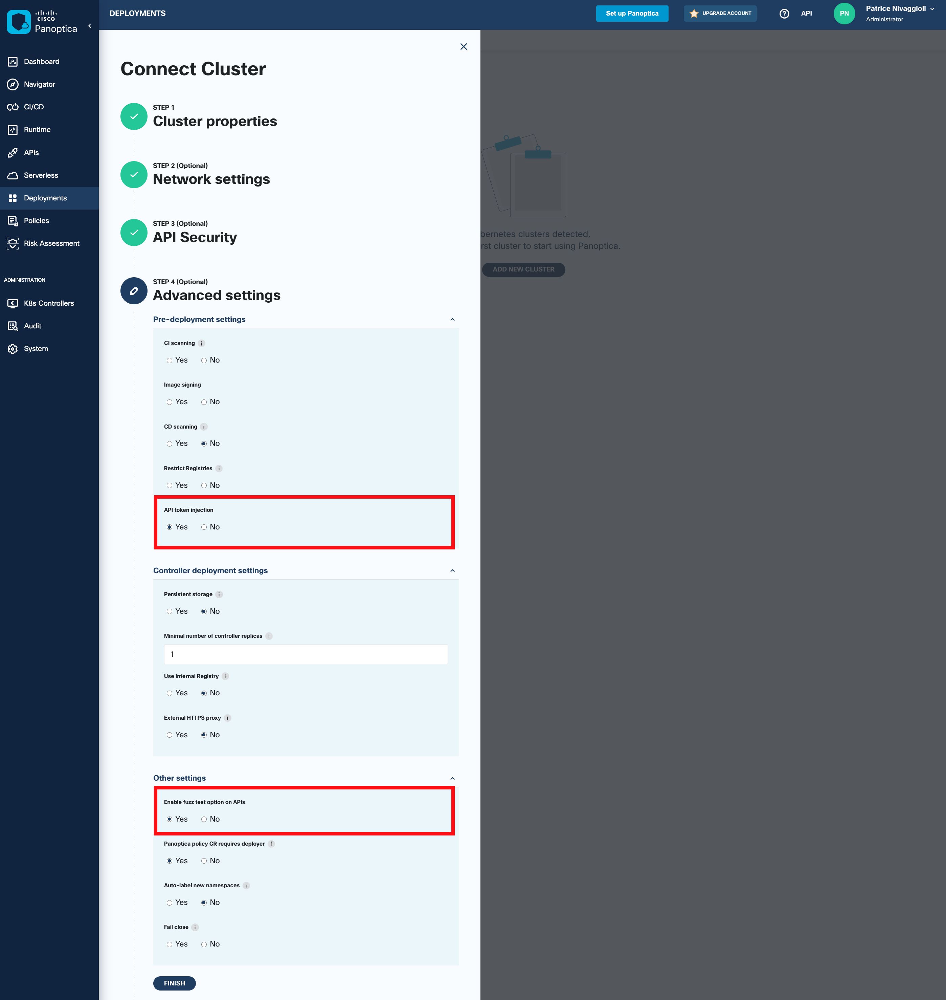
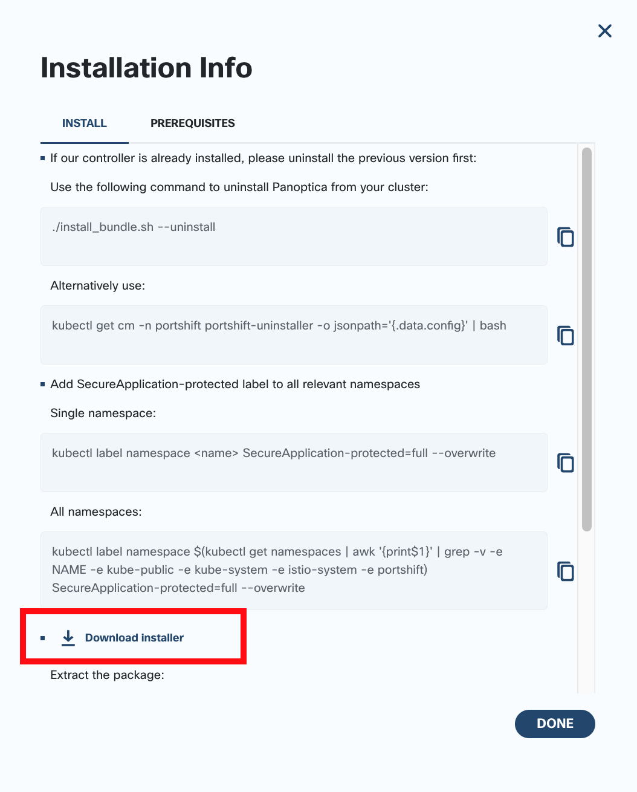
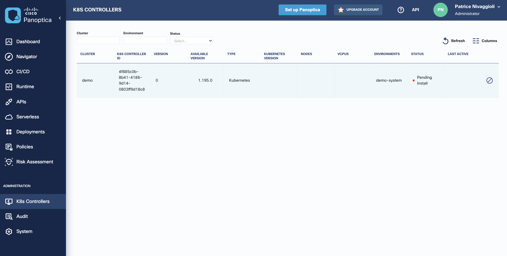
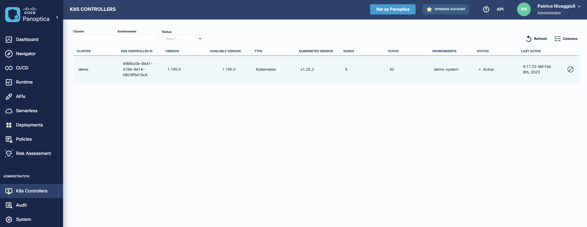

# 02. Panoptica Setup

## Objectives

In this section you will:

- Task 1. Create your Panoptica account
- Task 2. Add your K8s cluster to Panoptica
- Task 3. Deploy Panoptica access controller to your cluster
- Task 4. Check Panoptica deployment status
  
## Task 1. Create your Panoptica account

You will need a Panoptica account to start.

Navigate to the Panoptica URL to create your own account [Panoptica](https://www.panoptica.app/)

Click on the `Get Panoptica Free` button to register a free account


Click `Sign up` option and provide the required information to create you free account, or use your existing account.



Select whether to use your credentials with Google, Github, or Cisco to log in to Panoptica (using SSO), or whether to create unique credentials for Panoptica with an email and password. Click Sign up to continue the process. When the sign up process is complete, you will be re-directed to the Panoptica home page.

On subsequent log ins, select the SSO provider or enter your credentials directly to sign in, according to how you defined your account above.



Typically, you will receive an invitation email from Panoptica. Follow the link in the email to set up an account on Panoptica console.

With your account, you can deploy Panoptica agent on the lab environment Kubernetes cluster.

## Task 2. Add your K8s cluster to Panoptica

On the Panoptica dashboard, we provision a new deployment for our cluster-for-training cluster.

In Deployments tab, click the `Add New Cluster` button:



In Step 1, Cluster properties configure the following attributes:

**Cluster Name:** demo  
**Orchestration:** Generic Kubernetes Cluster  
**Required features:** tick both boxes for Kubernetes Security and API Security  



Click `Next` button to go to Step 2, Network settings.

Choose `Yes` for **Enable TLS inspection**



Click `Next` button to go to Step 3, API Security.

You can choose only **Istio** option as there is no External gateways in our lab.



Click `Next` button to go to Step 4, Advanced settings.

Select the following options:

**API token injection** Yes  
**Enable fuzz test option on APIs** Yes  



Click `Finish` button to generate the install bundle script.



Use the `Download installer` button to download the bundle installer archive. It has to be uploaded on your lab environment at the next step, it is not intended to be deployed on your local laptop.

Please click the `Done` button as the configuration for the Panoptica controller is finished.

From `K8s Controllers` tab, you can check the cluster is in `Pending Install` state:



## Task 3. Deploy Panoptica access controller to your cluster

Upload the file to your lab environment using the upload button:


Untar the install bundle on your lab environment:

```bash
mkdir $HOME/panoptica
tar -xvf $HOME/files/demo.tar.gz -C $HOME/panoptica
cd $HOME/panoptica
```

```console
eti-lab> mkdir $HOME/panoptica
eti-lab> tar -xvf $HOME/files/demo.tar.gz -C $HOME/panoptica
certs_gen_vault.sh
certs_gen_tracing.sh
securecn_bundle.yml
install_bundle.sh
eti-lab> cd $HOME/panoptica
eti-lab> 
```

Run the install bundle script:

```bash
./install_bundle.sh
```

```console
eti-lab> ./install_bundle.sh
WARNING: This version information is deprecated and will be replaced with the output from kubectl version --short.  Use --output=yaml|json to get the full version.
Installing istio custom resources
Finished creating istio custom resources

Installing istio components
Finished installing istio
creating folder vault_certs/
generating certificates in folder vault_certs/
+ set -euo pipefail
+ CERT_DIR=
+ SERVER_CONF=server.conf
+ ROOT_CA_CONF=ca.conf
+ ROOTCA_DAYS=3650
+ ROOTCA_KEYSZ=4096
+ ROOTCA_ORG=Vault
+ ROOTCA_CN='Root CA'
+ VAULT_KEYSZ=4096
+ VAULT_ORG=Vault
+ VAULT_CN='Vault Server'
+ getopts c: flag
+ case "${flag}" in
+ CERT_DIR=vault_certs/
+ getopts c: flag
+ main
+ create_cert_dir
++ mkdir -p vault_certs/
+ RESPONSE=
+ '[' 0 -ne 0 ']'
+ cd vault_certs/
+ generate_certs
+ echo 'generating ca.key'
+ openssl genrsa -out ca.key 4096
Generating RSA private key, 4096 bit long modulus (2 primes)
.....................................++++
.......++++
e is 65537 (0x010001)
++ echo vault_certs/
++ sed 's/\///1'
+ L=vault_certs
+ echo '[ req ]'
+ echo 'encrypt_key = no'
+ echo 'prompt = no'
+ echo 'utf8 = yes'
+ echo 'default_md = sha256'
+ echo 'default_bits = 4096'
+ echo 'req_extensions = req_ext'
+ echo 'x509_extensions = req_ext'
+ echo 'distinguished_name = req_dn'
+ echo '[ req_ext ]'
+ echo 'subjectKeyIdentifier = hash'
+ echo 'basicConstraints = critical, CA:true, pathlen:0'
+ echo 'keyUsage = critical, digitalSignature, nonRepudiation, keyEncipherment, keyCertSign'
+ echo 'extendedKeyUsage = serverAuth'
+ echo 'subjectAltName = IP:127.0.0.1, DNS:vault, DNS:vault.securecn-vault'
+ echo '[ req_dn ]'
+ echo 'O = Vault'
+ echo 'CN = Vault Server'
+ echo 'L = vault_certs'
+ echo 'generating server.key'
+ openssl genrsa -out server.key 4096
Generating RSA private key, 4096 bit long modulus (2 primes)
........++++
.....................................................++++
e is 65537 (0x010001)
+ echo 'generating server.csr'
+ openssl req -new -config server.conf -key server.key -out server.csr
+ echo '[ req ]'
+ echo 'encrypt_key = no'
+ echo 'prompt = no'
+ echo 'utf8 = yes'
+ echo 'default_md = sha256'
+ echo 'default_bits = 4096'
+ echo 'req_extensions = req_ext'
+ echo 'x509_extensions = req_ext'
+ echo 'distinguished_name = req_dn'
+ echo '[ req_ext ]'
+ echo 'subjectKeyIdentifier = hash'
+ echo 'basicConstraints = critical, CA:true'
+ echo 'keyUsage = critical, digitalSignature, nonRepudiation, keyEncipherment, keyCertSign'
+ echo '[ req_dn ]'
+ echo 'O = Vault'
+ echo 'CN = Root CA'
+ echo 'generating ca.csr'
+ openssl req -new -key ca.key -config ca.conf -out ca.csr
+ echo 'generating ca.crt'
+ openssl x509 -req -days 3650 -signkey ca.key -extensions req_ext -extfile ca.conf -in ca.csr -out ca.crt
Signature ok
subject=O = Vault, CN = Root CA
Getting Private key
+ echo 'generating server.crt'
+ openssl x509 -req -days 730 -CA ca.crt -CAkey ca.key -set_serial 1233 -extensions req_ext -extfile server.conf -in server.csr -out server.crt
Signature ok
subject=O = Vault, CN = Vault Server, L = vault_certs
Getting CA Private Key
+ echo 'done generating certificates'
+ echo ''
self signed certificates successfully generated for vault
namespace/securecn-vault created
secret/vault-tls created
creating folder tracing_certs/
generating certificates in folder tracing_certs/
Signature ok
subject=O = Cisco, CN = Root CA
Getting Private key
Signature ok
subject=O = Cisco, CN = portshift-agent, L = home/ubuntu/panoptica/tracing_certs/portshift-agent
Getting CA Private Key
Signature ok
subject=O = Cisco, CN = apiclarity, L = home/ubuntu/panoptica/tracing_certs/apiclarity
Getting CA Private Key
certificates successfully generated for tracing
creating portshift namespace
namespace/portshift created
configmap/portshift-root-ca.crt created
secret/portshift-agent-tls created
secret/apiclarity-tls created
Installing Panoptica components
Waiting for the Panoptica controller to be ready
Panoptica controller is ready
Waiting for the Bank-Vaults to be ready
Bank-Vaults is ready
Finished installing Panoptica
```

## Task 4. Check Panoptica deployment status

Check the Panoptica Pods are running correctly on your cluster:

```bash
kubectl get pods -n portshift
```

```console
eti-lab> kubectl get pods -n portshift
NAME                                  READY   STATUS    RESTARTS   AGE
apiclarity-5bfb74b768-h5ssn           2/2     Running   0          4m8s
apiclarity-postgresql-0               1/1     Running   0          4m13s
grype-server-755c7d9dd7-bctf2         1/1     Running   0          4m15s
kubeclarity-sbom-db-6ff98bbd5-krmqz   1/1     Running   0          4m15s
portshift-agent-59b7fd6769-crd4m      2/2     Running   0          4m8s
```

Check the Cluster status in K8s Controllers tab on the Panoptica dashboard:



Notice the status `Active` for the cluster.

---
