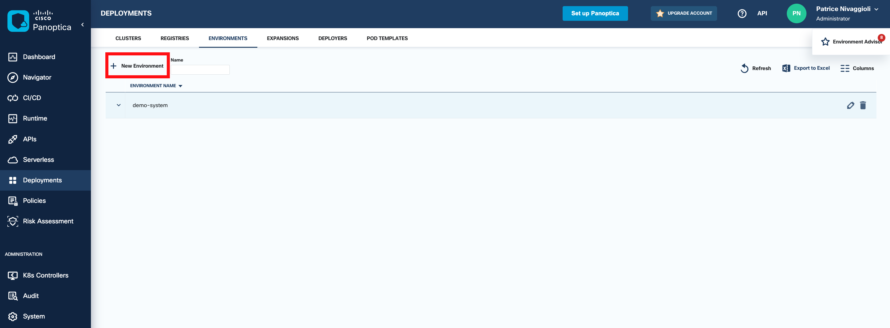
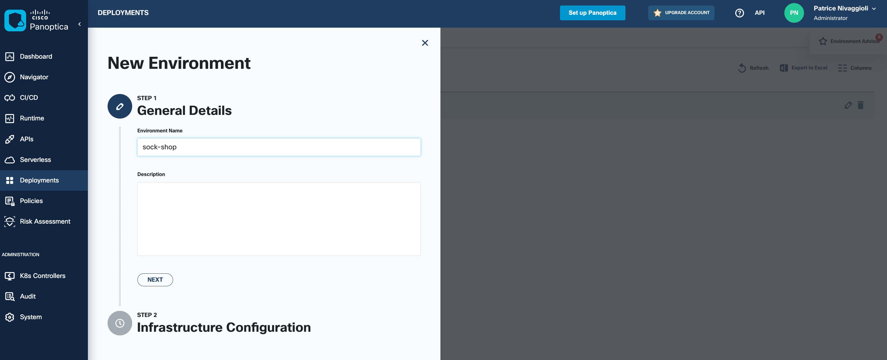
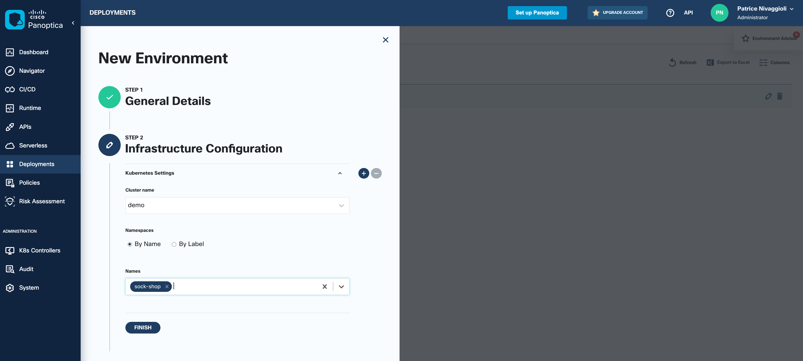
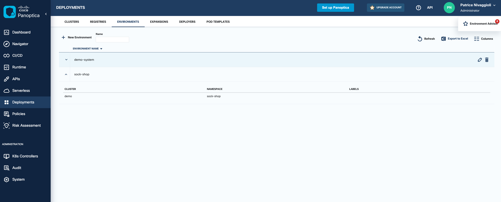
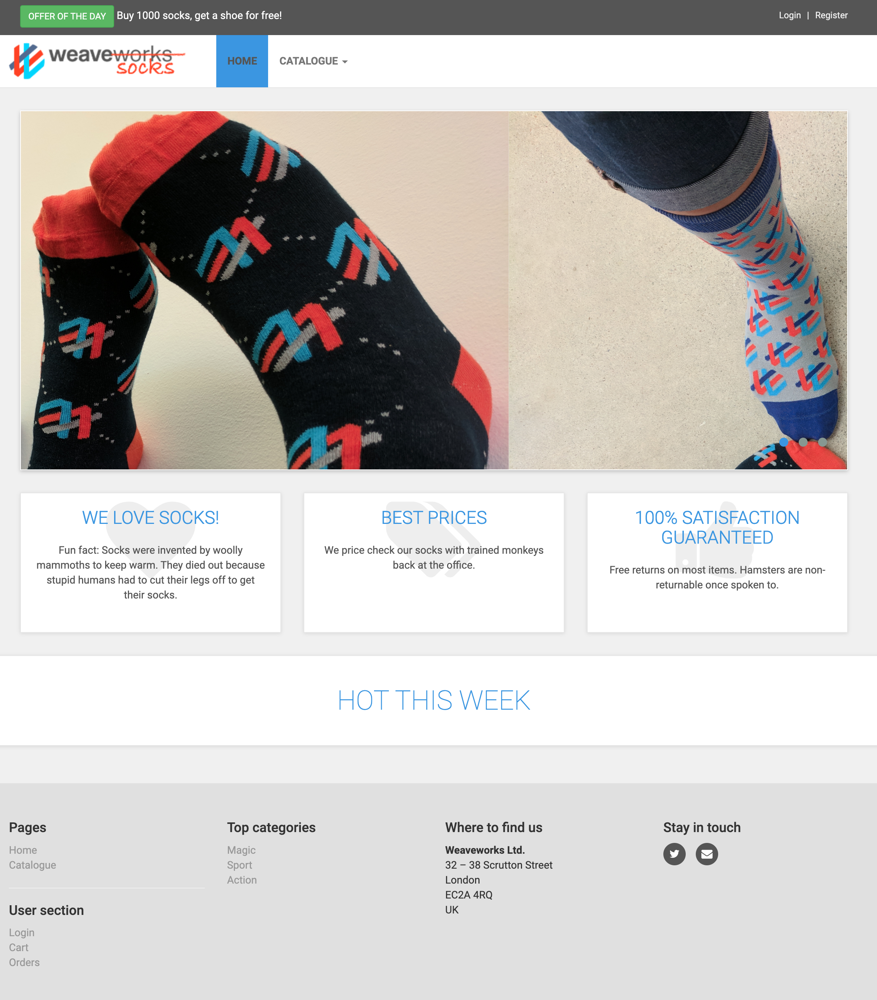

# 03. Vulnerable Application Deployment

## Objectives

In this section you will:

- Task 1. Create a labeled/protected namespace
- Task 2. Create a Panoptica environment for the app
- Task 3. Deploy Sock Shop Application
- Task 4. Expose the Sock Shop front end
- Task 5. Generate user traffic

## Application presentation

To learn the API security capabilities of Panoptica we will deploy the application sock-shop (<https://microservices-demo.github.io/>). Sock Shop is a microservices demo application that simulates the user-facing part of an e-commerce website that sells socks. It is used in our lab to demonstrate Panoptica API security capabilities.

Sock Shop front end screenshot:


It's based on a microservice architecture. Each micro-service communicates via REST APIs. Users can order socks via the UI or REST APIs.

When Sock Shop is deployed, Panoptica will discover the topology of the microservices and start to build images inventory and find related vulnerabilities. Panoptica will also analyze the risks associated with the deployment on the K8s runtime. During the lab session we will also ask Panoptica to find risk associated with internal and third party APIs.


We have modified the Sock Shop initial configuration to be capable to make orders and consume third party APIs on Paypal (api-m.sandbox.paypal.com).


## Panoptica configuration

### Task 1. Create a labeled/protected namespace

You can deploy the controller on one or more namespaces in the cluster. Namespaces that have a controller deployed will be protected by Panoptica.
Add a label on all the K8S cluster namespaces that will be controlled by the controller, using this command, for freshly created `sock-shop` namespace:

```bash
kubectl create namespace sock-shop
kubectl label namespace sock-shop SecureApplication-protected=full --overwrite
```

### Task 2. Create a Panoptica environment for the app

Environments are used to apply Panoptica runtime policies that regulate where workloads can run, and with whom they can communicate. You can, for example, define a policy that permits (or restricts) specific workloads (apps) to run on a specific named environment, or that allows (or denies) communication to or from workloads running on a specific environment.

Go to Panoptica dashboard under `Deployments` window and `Environments` tab to add a new environment:

Click `+ New Environment`



In Step 1, General details configure the following attributes:

**Environment Name:** sock-shop  



Then click `Next` button and in Step 2, Infrastructure Configuration select the following attributes in the drop down menus:

**Cluster Name:** demo  
**Namespaces:** By Name  
**Names:** sock-shop  



Then click the `Finish` button

You can check the environment has been created in the `Deployments` window under `Environments` tab:



Notice that another environment named `demo-system` has been automatically created for the `kube-system` and `kube-public` namespaces.

## Manage the Sock Shop application

### Task 3. Deploy Sock Shop Application

Run the following command to install the sock-shop application:

```bash
kubectl apply -f $HOME/lab/sock-shop/sock-shop-lb.yaml --namespace=sock-shop
```

You should have a similar output:

```console
eti-lab> kubectl apply -f $HOME/lab/sock-shop/sock-shop-lb.yaml --namespace=sock-shop
namespace/sock-shop created
Warning: spec.template.spec.nodeSelector[beta.kubernetes.io/os]: deprecated since v1.14; use "kubernetes.io/os" instead
deployment.apps/carts created
service/carts created
deployment.apps/carts-db created
service/carts-db created
deployment.apps/catalogue created
service/catalogue created
deployment.apps/catalogue-db created
service/catalogue-db created
deployment.apps/front-end created
service/front-end created
deployment.apps/orders created
service/orders created
deployment.apps/orders-db created
service/orders-db created
service/payment created
deployment.apps/payment created
deployment.apps/payment-db created
service/payment-db created
deployment.apps/queue-master created
service/queue-master created
deployment.apps/rabbitmq created
service/rabbitmq created
deployment.apps/session-db created
service/session-db created
deployment.apps/shipping created
service/shipping created
service/user created
deployment.apps/user created
service/user-db created
deployment.apps/user-db created
```

### Task 4. Expose the Sock Shop front end

Run the following command to expose Sock Shop front-end NodePort service outside the lab environment:

```bash
frontEndIngressIP=$(kubectl -n sock-shop get service front-end -o jsonpath='{.status.loadBalancer.ingress[0].ip}')
caddy reverse-proxy --from :8080 --to ${frontEndIngressIP}:80 > /dev/null 2>&1 &
```

Check the Sock Shop related Pods are created.

```bash
watch kubectl get pods -n sock-shop
```

You should have a similar output when the application is ready:

```console
Every 2.0s: kubectl get pods -n sock-shop                                                                                   ip-172-31-48-222: Wed Dec 14 14:40:37 2022

NAME                            READY   STATUS             RESTARTS       AGE
carts-85f4d4b45-sj92n           3/3     Running   0             88s
carts-db-59578c5464-ckwtn       3/3     Running   0             88s
catalogue-bbdcf5467-2v4ks       3/3     Running   0             88s
catalogue-db-6bf8d6ff8f-ph62m   3/3     Running   0             88s
front-end-7b4dfc5669-6xsbg      3/3     Running   0             88s
orders-7f57779c86-ss6m2         3/3     Running   0             88s
orders-db-848c4c6db4-rtjnk      3/3     Running   0             88s
payment-cdf9694b4-gf6zx         3/3     Running   0             88s
payment-db-55cf8bcffb-ncfvx     3/3     Running   0             88s
queue-master-96b8bb948-mnp4p    3/3     Running   0             88s
rabbitmq-f5b858486-v5cwx        4/4     Running   0             87s
session-db-7b8844d8d5-xbxqr     3/3     Running   0             87s
shipping-797475685c-lzv5v       3/3     Running   0             87s
user-7c48486d5-244vz            3/3     Running   1 (75s ago)   87s
user-db-767cf48587-jj7zg        3/3     Running   0             87s
```

Enter `CTL^C` to exit the command.

Then check you can get access to Sock Shop application with the following link [Sock Shop](http://location.hostname:8080)



---

## Generate Traffic Load 

### Task 5. Generate user traffic

Let's deploy a locust script which emulates users browsing and ordering products.

Execute the following command to inject the python script into a configmap:

```bash
kubectl create configmap --dry-run=client user-traffic-load-configmap --from-file=$HOME/lab/sock-shop/user-traffic-load.py --output yaml | tee $HOME/user-traffic-load-configmap.yaml
```

Deploy the configmap:

```bash
kubectl apply -f $HOME/user-traffic-load-configmap.yaml --namespace=sock-shop
```

Deploy a pod under the sock-shop namespace which will consume the configmap and run user traffic.

```bash
kubectl apply -f $HOME/lab/sock-shop/user-traffic-load-deployment.yaml --namespace=sock-shop
```

---
