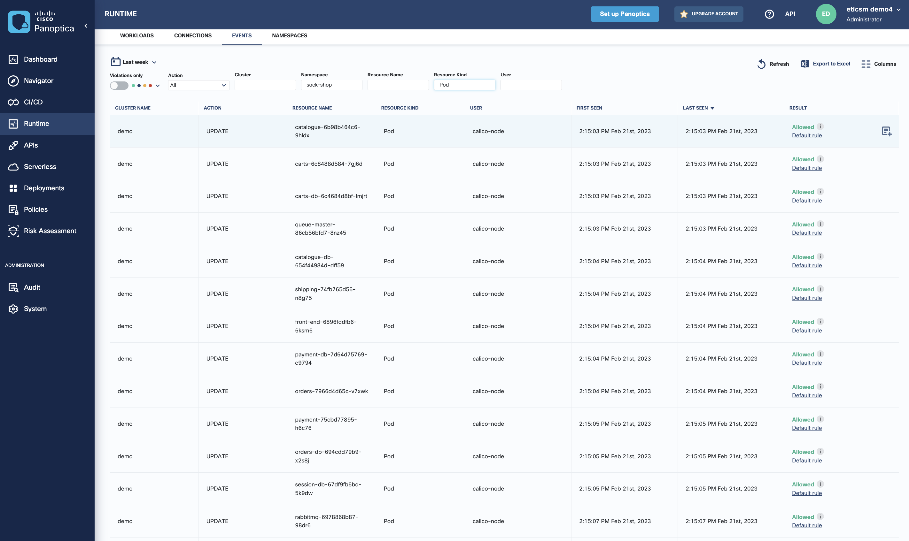

# 04. Runtime Visualization

## Objectives

- Task 1. Understand Main Dashboard info
- Task 2. Check the K8SHIELD (Mitre Attack) Dashboard
- Task 3. Visualize Workloads
- Task 4. Understand Workload Risk
- Task 5. Visualize Network Activity
- Task 6. Visualize Runtime Cluster Events

## Task 1. Understand Main Dashboard info

In your Panoptica.app portal, select the `Dashboard` / `OVERVIEW` tab.

The home page of the Cisco Panoptica Cloud application is a Dashboard view. This view shows summary of Panoptica activity in your account.

The Dashboard has the following widgets:

- Top security risks: This widget shows the running workloads, APIs, or Serverless functions with the highest Workload Risk.
- Workload Vulnerabilities: This widget shows the number of vulnerabilities found in the cluster, broken down by severity. The top of the widget shows the number of images and pods in the cluster.
- Permissions: This widget shows the number of permission risks in the cluster, broken down by risk level.
- Trends: This widget shows the number of connections, events, or pods over time for the selected cluster.
- Namespaces, pods & expansions: This widget shows the number of namespaces, pods, and expansions in the cluster. For namespaces and pods, the first number (in red) is the number of protected namespaces or pods on protected namespaces in the selected cluster. The second number (grey) is the total number in the cluster.

## Task 2. Check the K8SHIELD (Mitre Attack) Dashboard

In your Panoptica.app portal, select the `Dashboard` / `K8SHIELD` tab.

The K8SHIELD Dashboard is a unique and innovative view of the attack threats facing your Kubernetes cluster environments, the vulnerabilities that expose your clusters to these attacks, and the remedies you can apply to plug the gaps.

The view is arranged according to the popular MITRE ATT&CK matrix, which follows the progression of attacks from Initial Access through to Lateral Movement and Impact. Cisco Panoptica has innovated on this scale by adding cells relevant for Kubernetes for each level in the scale.

Cisco Panoptica checks the clusters that are protected by it for threats according to these cells.

In each cell , the K8SHIELD dashboard shows relevant attack techniques, and indicates if your clusters are exposed to them (by a warning symbol).

At the top of the dashboard, you have a summary of your clusters and the security threats. You can select which cluster (or all of them) for which to show the matrix.

## Task 3. Visualize Workloads

In your Panoptica.app portal, select the `Runtime` / `WORKLOADS` tab.

When you deploy the Cisco Panoptica controller on a Kubernetes cluster, you gain visibility into all the workloads that are running on the host or cluster.

The main view shows:

- the workload name
- the environment in which it is running
- the risk (from the environment)
- the runtime status
- the workload status (active or inactive)
- the time it was last seen (detected)

It also indicates if the workload is protected, that is, the workload is in a namespace that has Panoptica deployed on it.

You can filter the view based on `Highest Vulnerability`, `Workload Risk`, `Identified` status, `Protected` status, `Clusters and Namespaces`, `Environment` and `Workload`. The current view is filtered with Protected = TRUE criteria.

You can also define runtime policies to govern which workloads are allowed to run in your environments.

## Task 4. Understand Workload Risk

Click on the name of a workload (left-most column) to show more detail. For example `front-end`.

The `DETAILS and RISK` tab summarizes the risks detected in the workload (images vulnerabilities) and its deployment (runtime risks).

The `POD TEMPLATE` tab highlights the POD configuration when the `SECURITY CONTEXT` tab provides K8s security context configuration for the POD.

Select < Workloads to come back to the main view.

## Task 5. Visualize Network Activity

In your Panoptica.app portal, select the `Runtime` / `CONNECTIONS` tab.

The Connections view shows a list of connections (network activity) between workloads in your environments.

You can also define runtime policies to govern which communication are allowed between workloads or environment.

## Task 6. Visualize Runtime Cluster Events

In your Panoptica.app portal, select the `Runtime` / `EVENTS` tab.

The Events view shows runtime cluster events that were detected on your environments.

On the above view we filtered on `Namespace = sock-shop` as well as `Resource Kind = Pod`.

We have also modified the columns visualization as on the below screenshot.

You can also define runtime policies to govern which events are allowed or not.

---
