# 05. Runtime Policies

## Objectives

- Task 1. Understand Deployment Policy
- Task 2. Understand Connection Policy
- Task 3. Understand Cluster Events Policy
- Task 4. Understand Pod Security Standards
- Task 5. Understand Policy Advisor

Cisco Panoptica runtime policies govern workload activities in your Panoptica environments. They control which workloads are permitted to run in the environment, and with which other workloads they can communicate while running.

A Panoptica policy is a set of rules, similar to firewall policies and rules, but Panoptica policies manage workloads and environments, not IP addresses and ports. A rule to allow a workload to run in an environment remains unchanged if the environment changes from one physical host or cluster to another.

Panoptica has several types of runtime policy, which you can use to control workloads in your environments.

## Task 1. Understand Deployment Policy

The Deployment policy controls which workloads can run on a Panoptica environment. It consists of rule statements of the form 'allow workload A in Environment B' or 'restrict workload C in Environment D'. When a workload is deployed to an environment, Panoptica agent checks the identity, and then checks the policy rules for a rule that allows it to run. If one is found,the workload is allowed. If not, or if there is a rule which restricts it, it is not blocked from running.

Rules specify workloads according to name, type, or label.

You can check and configure the deployment policies in the `Policies` and `DEPLOYMENT RULES` tab:

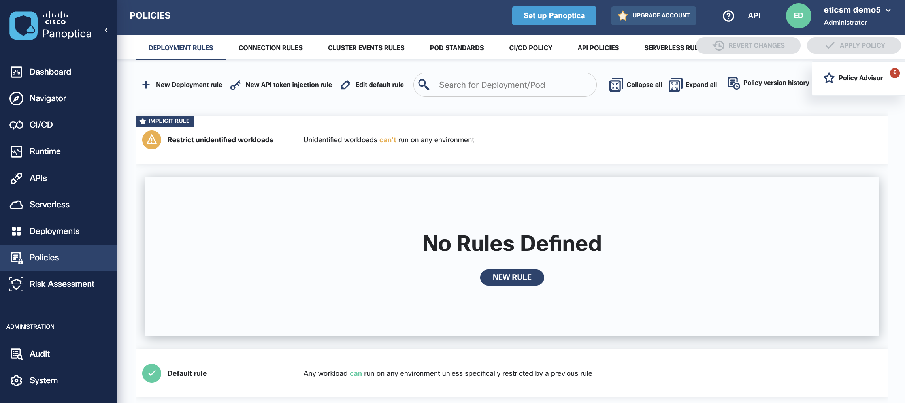

## Task 2. Understand Connection Policy

The Connection policy controls connections between workloads in a Panoptica, including connections with external applications (that is, applications not running on a Panoptica environment). It consists of rule statements of the form 'allow connections between source S and destination D' or 'restrict connections between source X and destination Y'. In these rules, the source and destination are workloads, environments, or external applications.

Panoptica uses the Istio service mesh to apply the connection policy rules to workloads running on your environments.

Rules can allow or deny connections between workloads, and also enforce encryption between them (implemented in the Istio service mesh).

You can check and configure the connection policies in the `Policies` and `CONNECTION RULES` tab:

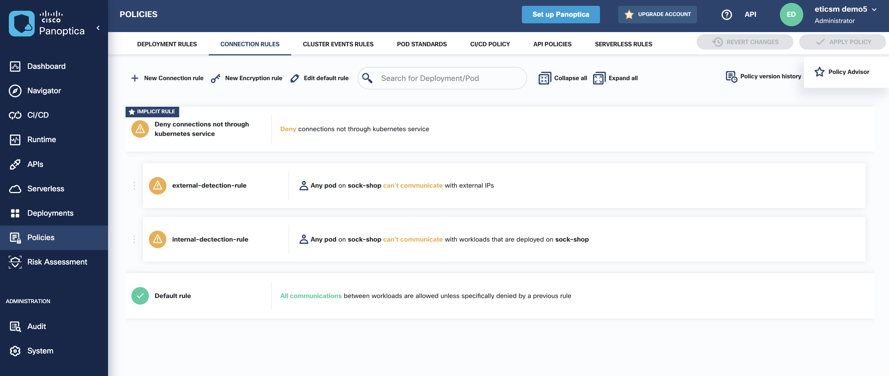

Create the external-detection-policy as below

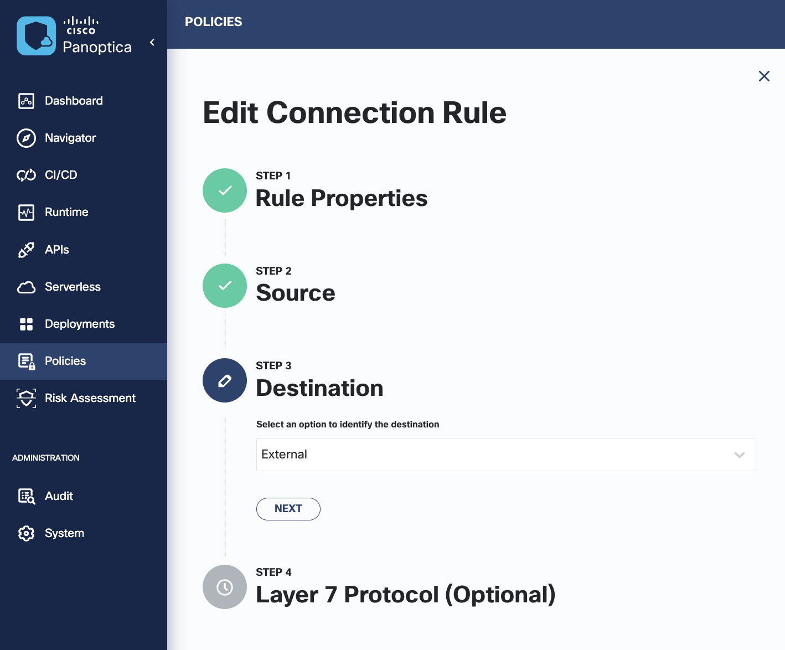

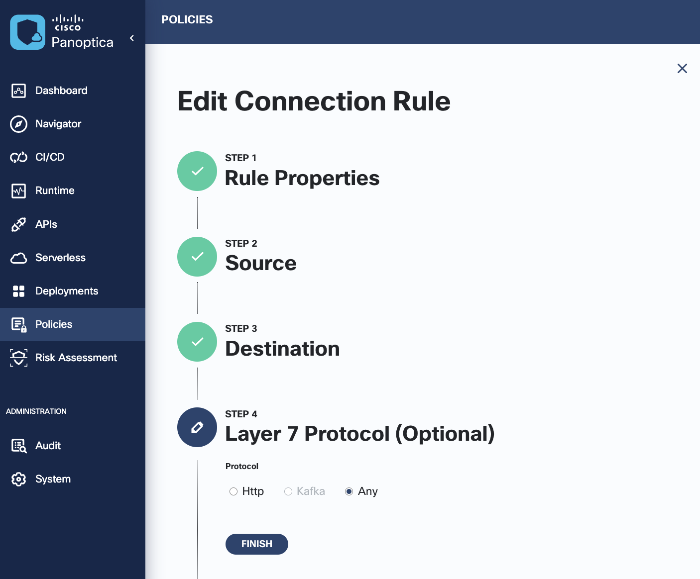

Create the internal-detection-policy as below

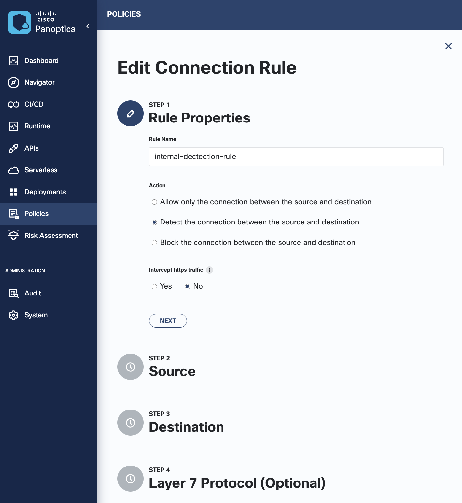

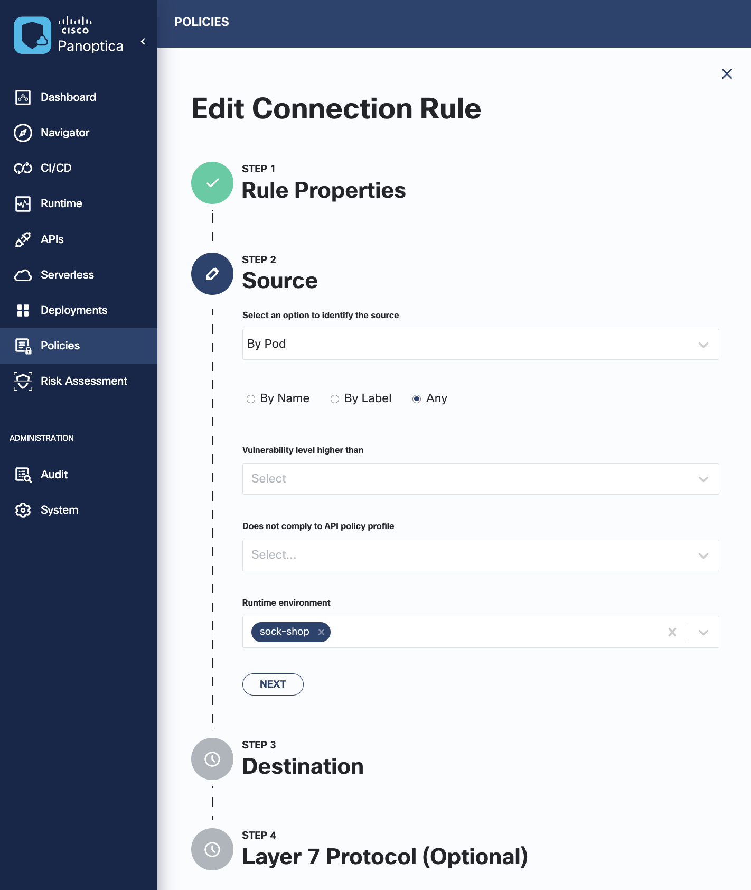

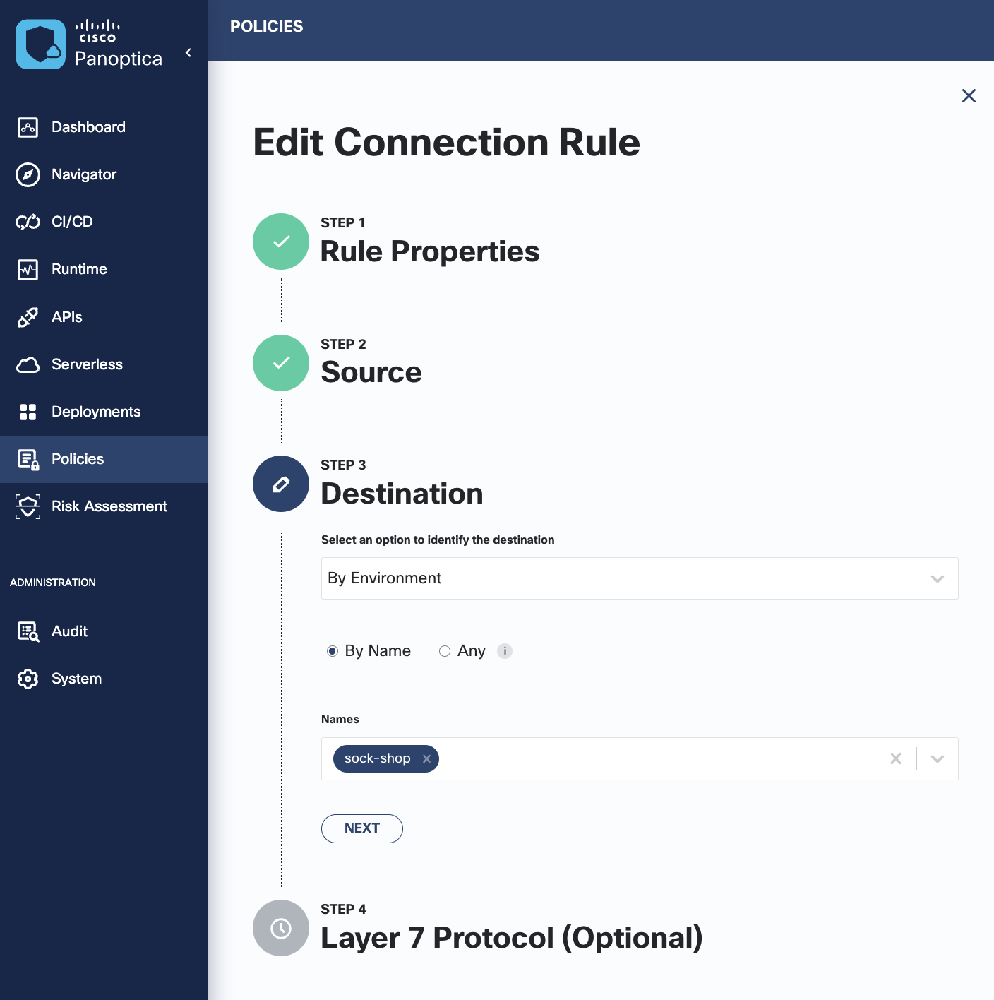

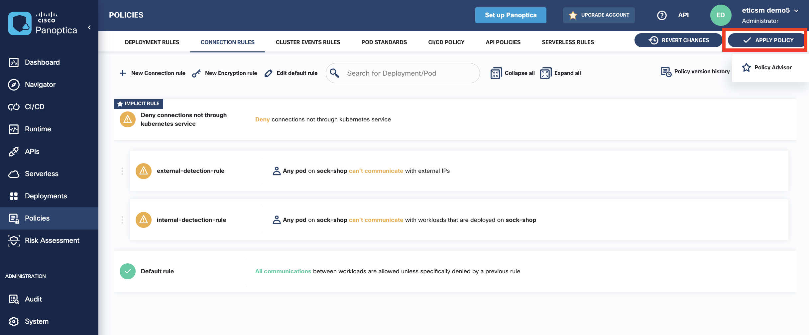

## Task 3. Understand Cluster Events Policy

The Cluster runtime policy monitors activities on the control planes of your clusters, and enforces rules to permit or block specific types of actions. These can alert, or prevent, unwanted or suspicious actions on resources in your clusters.

You can check and configure the deployment policies in the `Policies` and `CLUSTER EVENT RULES` tab:

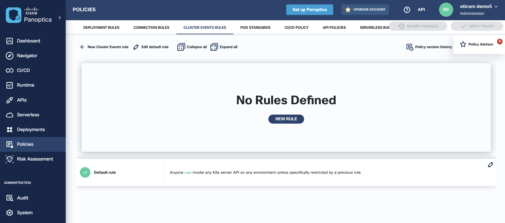

## Task 4. Understand Pod Security Standards

Pod Policies are filter options for Panoptica Deployment Policy Rules, to give you additional filtering choices for workloads, according to properties of the Kubernetes Pod on which they are running.

You can check and configure the deployment policies in the `Policies` and `POD STANDARDS` tab:

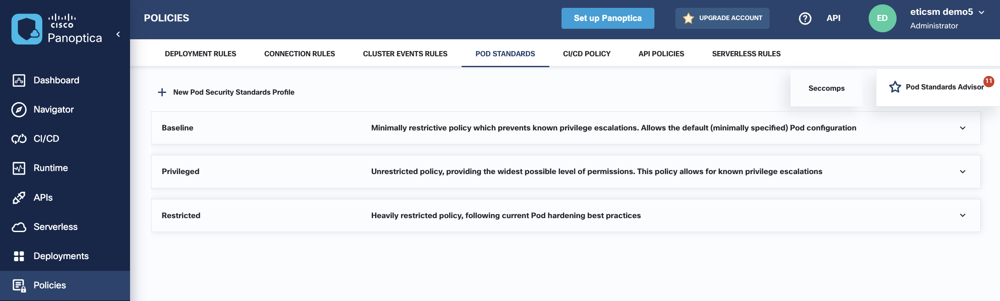

## Task 5. Understand Policy Advisor

The Cisco Panoptica Policy Advisor can assist you in defining the right set of policy rules for your protected clusters. This will ensure that your runtime environment is correctly configured for the workloads and traffic patterns you want.

The Advisor suggests rules for you to add to your Panoptica Runtime Policies, based on actual activity in your environments. You can accept the suggestions, or ignore them.

The Policy Advisor offers these suggestions:

- Environments: these are suggested environments that should be added, for workloads that are are not in environments. These are suggested on the ENVIRONMENTS tab of the Deployments page.
- Deployment rules: these are suggested deployment rules for to permit workloads to run in environments, that are not otherwise covered by other environment rules. These are suggested on the DEPLOYMENT RULES tab of the Policies page.
- Connection rules: these are suggested rules for connections between workloads, not otherwise covered by other connection rules. These are suggested on the CONNECTION RULES tab of the Policies page.
- Pod Policies: these are suggested rules for PSP policies. These are suggested on the POD POLICIES tab of the Policies page.

You can check and run the policy advisor in the top right of the `Policies` tab:

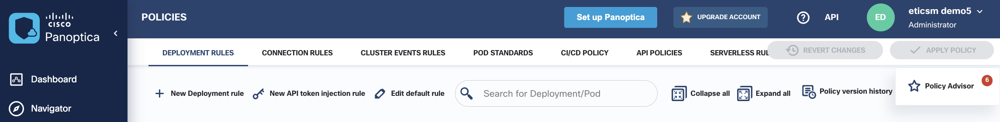

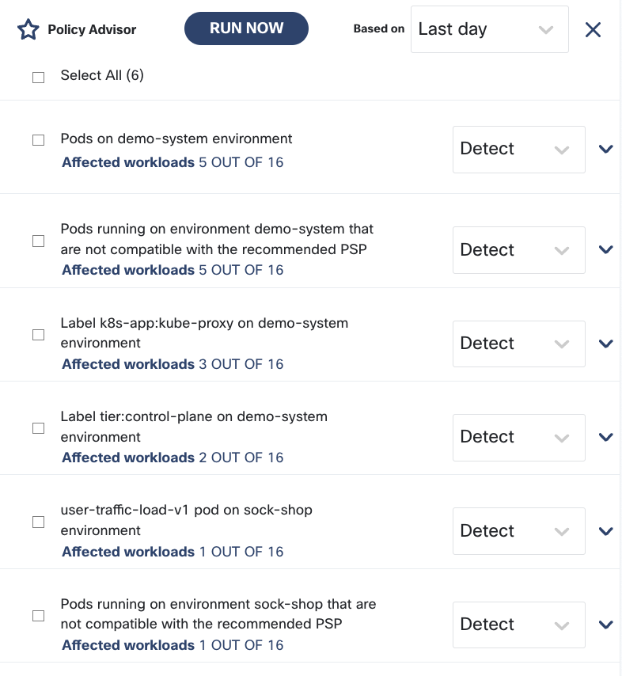

---
