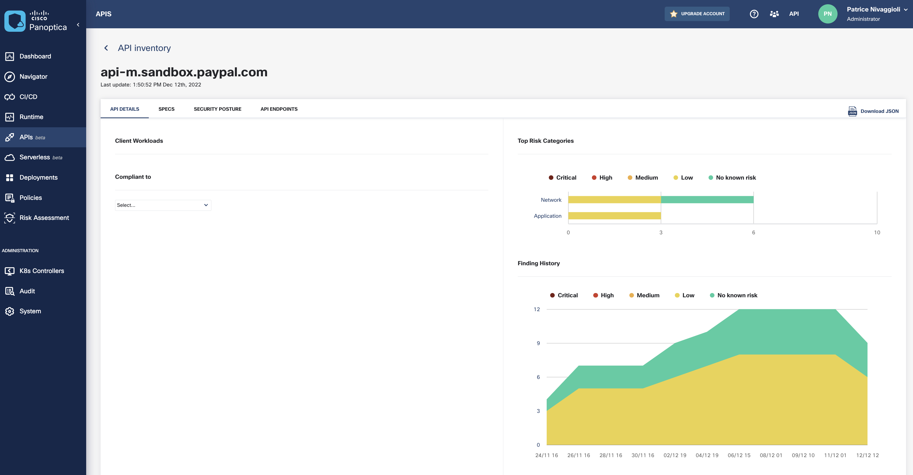

# 05. Third Party APIs

## Objectives

In this section you will:

- Task 1. Check Third Party APIs
- Task 2. API spec analysis

## Task 1. Check Third Party APIs

The `THIRD PARTY APIS` tab under APIs page shows third party APIs consumed by workloads in your cluster.

For more details click on the *api-m.sandbox.paypal.com* API.

## Task 2. API spec analysis

Download the OpenAPI spec for the current third party API from [here](https://eti-demos.github.io/sockshoppayload/paypal.json)

Choose the Spec tab.

Drag the downloaded json file and click Finish.

After the spec has been uploaded and analyzed, open the Security Posture tab and review the discovered risks.

Take a look at another risk finding: insecure authentication mechanism.

"This means that if an eavesdropper manages to access the credentials in a single API operation, it can reuse them to authenticate to the API server." Combined with an endpoint using HTTP instead of HTTPS,
This situation would require special attention:

