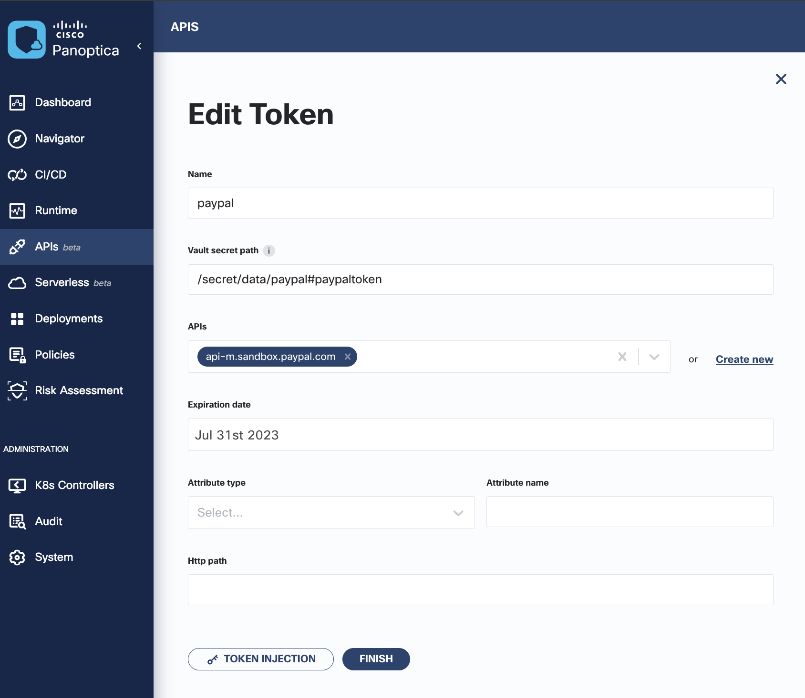
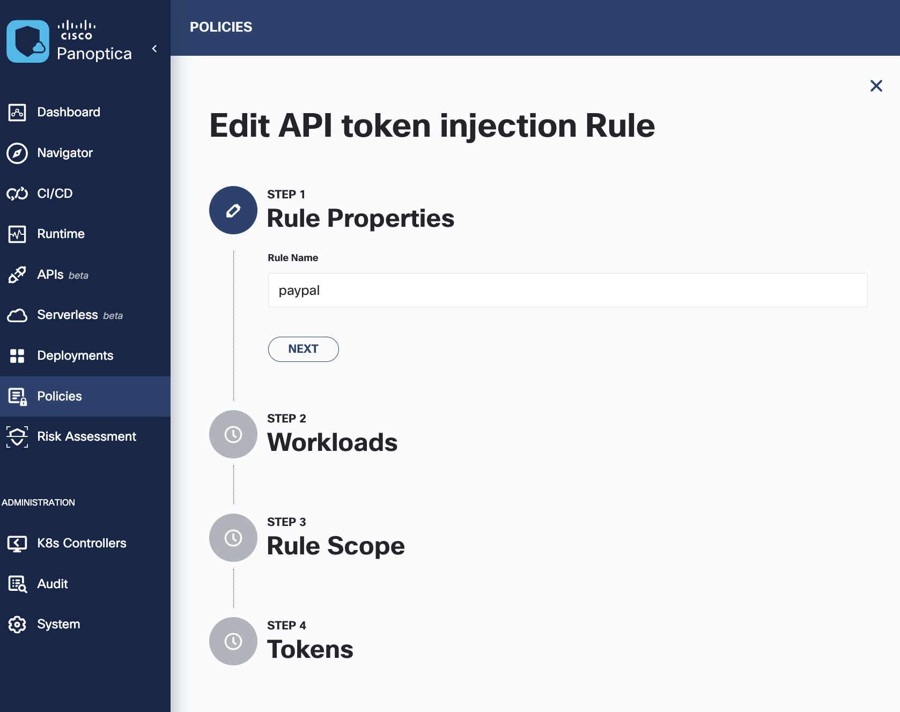
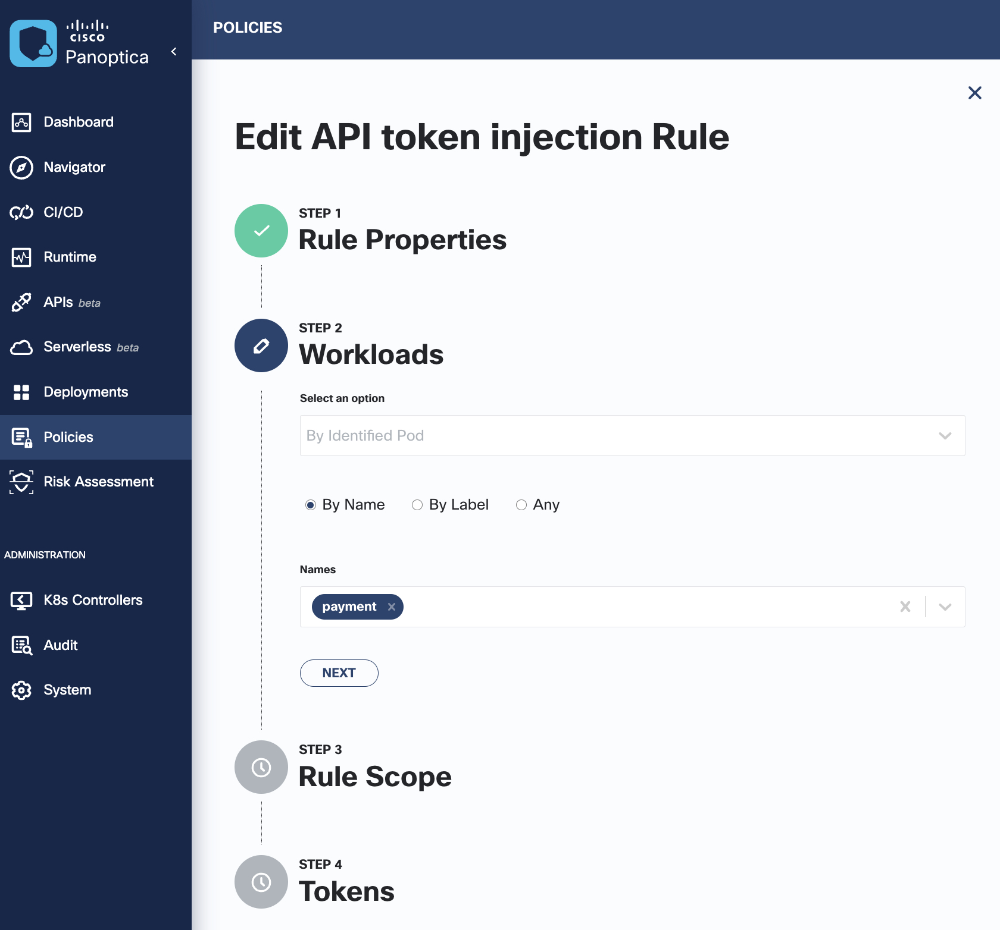
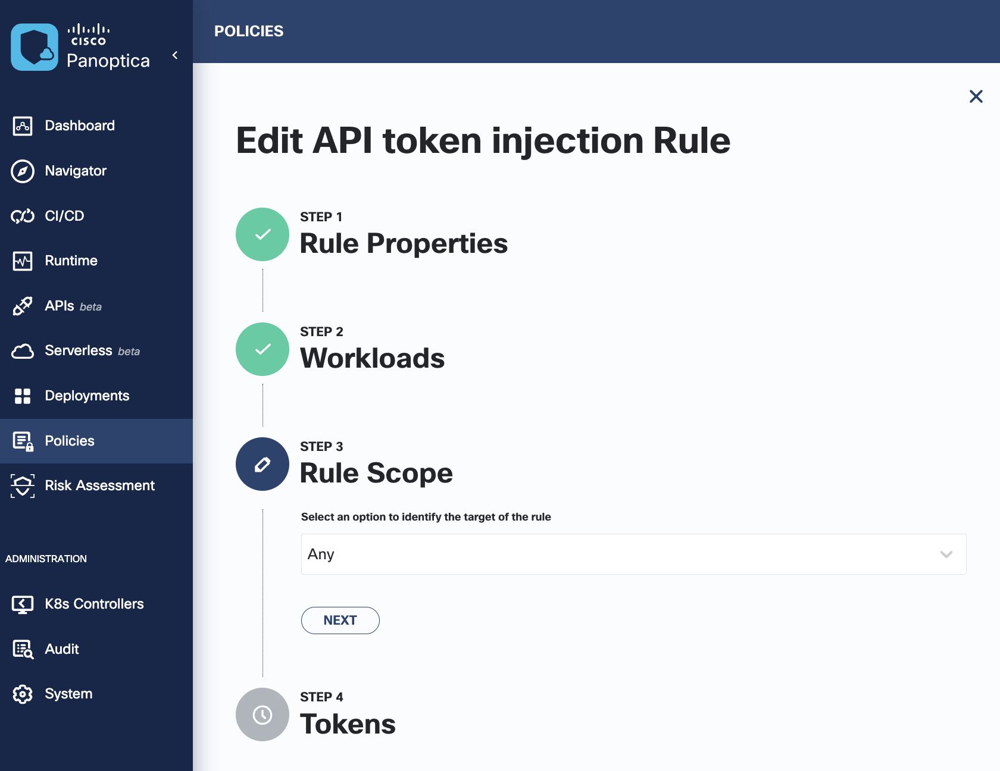
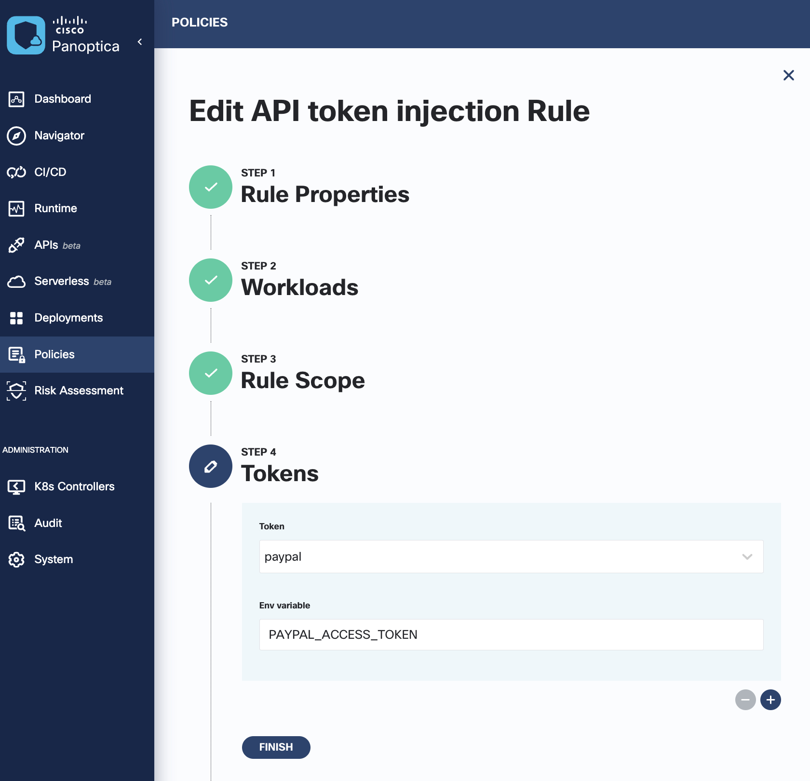
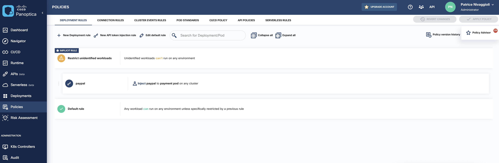

# 06. API Token Injection

Cisco Panoptica can securely manage tokens that you use to access your API sites. It stores them securely in a Vault, and securely injects them into your workloads (as environment variables) when they are deployed in clusters.

Panoptica management of API tokens has these advantages:

- Tokens are stored in a secure Vault deployed in your cluster, which is more secure than Kubernetes secrets, or hard-coded tokens.
- Tokens are only injected into the workload when they are deployed, minimizing exposure.
- You can create and apply Panoptica Deployment Policy rules to control which workloads can access specific APIs using the stored tokens.

## Objectives

In this section you will:

- Task 1. Test Pods Before Token Injection
- Task 2. Add a Token
- Task 3. Add an Injection Policy for the Token
- Task 4. Add a secret to the vault
- Task 5. Validate token injection
- Task 6. Verify application topology

## Task 1. Test Pods Before Token Injection

Verify running pods before token injection. By default they are started without it.

```bash
kubectl describe pod -n sock-shop -l app=payment | grep vault:/secret/data/paypal#paypaltoken
```

Expect an empty output:

```console
eti-lab> kubectl describe pod -n sock-shop -l app=payment | grep vault:/secret/data/paypal#paypaltoken
eti-lab>
```


## Task 2. Add a Token

- In the `TOKENS` tab of the `APIs` page, click New Token:



- **Name**: Enter a name for the token, as it will appear in the list in the TOKENS tab: `paypal`
- **Vault secret path**: Enter the path to the secret in the Vault: `/secret/data/paypal#paypaltoken`
- **APIs**: Click *Create new* to add `api-m.sandbox.paypal.com`
- **Expiration date**: Set an Expiration Date for the token: `Jul 31st 2023` (at the time of the writing)

## Task 3. Add an Injection Policy for the token

Click on `TOKEN INJECTION` button, this opens a new Deployment Policy rule for Token Injection. The tokens in the rule will be injected into the workloads selected by the rule, as environment variables. Complete the following steps:

- Rule Properties



- Workloads
  


- Rule Scope



- Tokens



Don't forget to apply the new policy:


You can verify your configuration under `Policies` page and `Deployment Rules` tab, the `paypal` rules should be listed:



## Task 4. Add a secret to the vault

Run the following script to get the `API_ACCESS_TOKEN` from Paypal API and add it as a secret in the bank-vaults:

```bash
cd ~/lab/sock-shop
chmod +x execute.sh
chmod +x clean.sh
./execute.sh
```

The script will also restart the Pods to allow for token injection. You should have an output similar to:

```console
eti-lab> cd ~/lab/sock-shop
eti-lab> chmod +x execute.sh
eti-lab> chmod +x clean.sh
eti-lab> ./execute.sh
Success! Data deleted (if it existed) at: secret/paypal
Paypal access token: A21AAL-1ejtro28QI0Jqcgiq1iKpOippNr4zBJ9_UnO4W2OrCSpRlT3UzEfDxZhfcWfZRFFcKphKy0rMVLZiMWHjQLdHWiEuQ
Key              Value
---              -----
created_time     2022-12-14T13:21:23.270567663Z
deletion_time    n/a
destroyed        false
version          1
Waiting for the policy to be effective ...
Restartng the relevant pod to allow for injection
pod "payment-cdf9694b4-n2r7t" deleted
pod "payment-db-55cf8bcffb-s7fpj" deleted
Waiting for user pod to be ready ...
User pod is now running.
payment-cdf9694b4-tds52
payment-db-55cf8bcffb-hltqp
```

## Task 5. Validate token injection

Open the payment description and search for the injected vault

```bash
kubectl describe pod -n sock-shop -l app=payment | grep vault:/secret/data/paypal#paypaltoken
```

Expected output:

```console
eti-lab> kubectl describe pod -n sock-shop -l app=payment | grep vault:/secret/data/paypal#paypaltoken
      PAYPAL_ACCESS_TOKEN:           vault:/secret/data/paypal#paypaltoken
```

## Task 6. Verify application topology

Once the API token is successfully injected, the vulnerable application is completely functioning: it offers a catalogue, a cart, a payment and checkout functionality.

Verify in the navigator all application services are known to Panoptica. Use *Expand all* button to observe the full mesh of application services.


---
