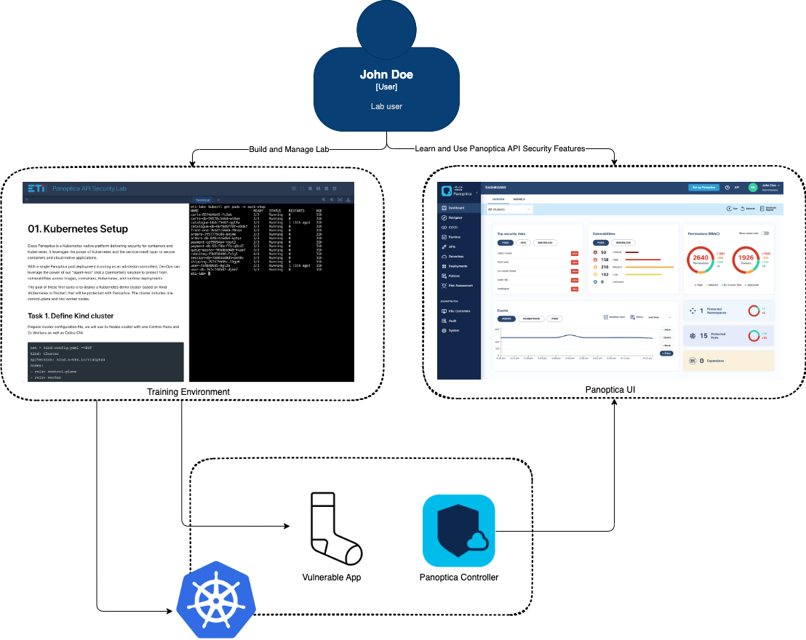

# Panoptica API Security

The repository provides an introduction lab to Panoptica API Security capabilities. As a target application a custom version of weave's sock shop is used.The following sections are currently available:

- [01. Kubernetes Setup](01.kubernetes-setup.md)
- [02. Panoptica Setup](02.panoptica-setup.md)
- [03. Vulnerable Application Deployment](03.vulnerable-app-deployment.md)
- [04. API Token Injection](04.api-token-injection.md)
- [05. Third Party APIs](05.third-party-apis.md)
- [06. OpenAPI Reconstruction and Risk Findings Analysis](06.openapi-spec-reconstr-and-analysis.md)
- [07. OpenAPI Specification Upload and Difference Detection](07.openapi-spec-upload-and-diff.md)
- [08. BFLA Finding](08.bfla-finding.md)
- [09. API Trace Analysis](09.api-trace-analysis.md)
- [10. API Fuzzing Testing](10.api-fuzzing-testing.md)
- [11. Policies](11.policy.md)

The notions covered are the following:

- [01. Kubernetes Setup](01.kubernetes-setup.md): deploy Kind Kubernetes cluster with 1x control plane, 2x workers and Calico CNI
- [02. Panoptica Setup](02.panoptica-setup.md): setup a Panoptica free account and use Terraform to onboard the K8s cluster
- [03. Vulnerable Application Deployment](03.vulnerable-app-deployment.md): 
  - create protected namespace
  - create application environment
  - manage Sock Shop application and deployment
  - generate traffic load
- [04. API Token Injection](04.api-token-injection.md):
  - configure API token injection on Paypal API
- [05. Third Party APIs](05.third-party-apis.md):
  - check third party APIs
- [06. OpenAPI Reconstruction and Risk Findings Analysis](06.openapi-spec-reconstr-and-analysis.md):
  - analysis of discovered APIs
  - OpenAPI spec reconstruction
  - analysis of spec risk findings
- [07. OpenAPI Specification Upload and Difference Detection](07.openapi-spec-upload-and-diff.md):
  - upload OpenAPI spec
  - detect differences between expected and real traffic based on given OpenAPI spec
- [08. BFLA Finding](08.bfla-finding.md):
  - build authorization model of applications
  - detect micro-service BFLA
- [09. API Trace Analysis](09.api-trace-analysis.md):
  - trace analysis of real traffic
- [10. API Fuzzing Testing](10.api-fuzzing-testing.md)
- [11. Policies](11.policy.md):
  - connection policy to block inter-service traffic